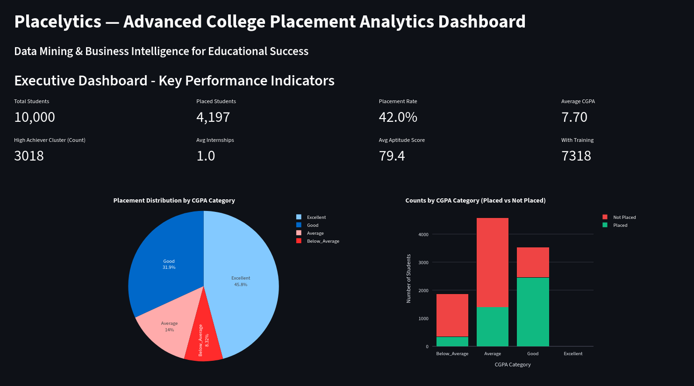

# Placelytics — College Placement Data Analysis & Prediction



## Project Overview
**Domain:** Education Analytics & Data Mining  
**Objective:** Advanced Data Mining and Business Intelligence analysis of student placement data with predictive modeling  
**Dataset:** 10,000 student records with 12 core features plus 6 engineered features  
**Overall Placement Rate:** 42.0%  
**Technology Stack:** Python, Scikit-learn, Streamlit, Pandas, NumPy

**📄 Complete project overview and detailed analysis available in [Placelytics - Report.pdf](https://docs.google.com/document/d/1S7YISCPXFQE48_2qo07bjtM4rMlxr2ycTGztADPoy3A/edit?tab=t.0)**

## Key Results & Performance

### Best Performing Models
- **Logistic Regression:** 80.15% accuracy, 86.95% AUC (Best Overall)
- **Random Forest:** 77.90% accuracy, 85.20% AUC
- **Gradient Boosting:** 79.65% accuracy, 86.65% AUC
- **Ensemble Model:** Weighted combination for enhanced predictions

### Top Success Factors (Feature Importance)
1. **Competency Score** (19.08%) - Engineered feature combining aptitude and soft skills
2. **HSC Marks** (17.00%) - Higher secondary education performance
3. **Academic Index** (14.57%) - Weighted academic performance metric
4. **Aptitude Test Score** (10.73%) - Technical assessment results
5. **SSC Marks** (9.53%) - Secondary education foundation

## Business Intelligence Insights

### Key Findings from DMBI Analysis
- **Academic Excellence Impact:** Students with CGPA ≥ 8.0 have 68.2% placement rate
- **Experience Multiplier:** Students with ≥2 internships achieve 69.7% placement rate
- **Skill Development:** Students with aptitude ≥85 have 75.6% placement rate
- **Training Effectiveness:** Placement training increases success by 1.4x
- **Risk Identification:** 4,657 students (46.6%) identified as at-risk

**📄 Complete business intelligence analysis and insights available in [Placelytics - Report.pdf](https://docs.google.com/document/d/1S7YISCPXFQE48_2qo07bjtM4rMlxr2ycTGztADPoy3A/edit?tab=t.0)**

### Student Segmentation (K-Means Clustering)
- **Cluster 0 - Moderate Performers:** 2,767 students, 49.2% placement rate
- **Cluster 1 - Developing Students:** 1,794 students, 5.7% placement rate
- **Cluster 2 - Average Achievers:** 2,640 students, 16.6% placement rate
- **Cluster 3 - High Achievers:** 2,799 students, 82.0% placement rate

## Technical Implementation

### Libraries & Dependencies
- **Core Processing:** pandas, numpy, scipy
- **Machine Learning:** scikit-learn (multiple algorithms)
- **Visualization:** matplotlib, seaborn, plotly
- **Dashboard:** streamlit
- **Statistical Analysis:** scipy.stats

### Advanced DMBI Techniques Implemented
1. **Feature Engineering:** Academic Index, Experience Score, Competency Score
2. **Clustering Analysis:** K-Means student segmentation
3. **Statistical Testing:** Chi-square tests for feature association
4. **Dimensionality Reduction:** PCA analysis
5. **Risk Analytics:** Multi-factor risk scoring
6. **Correlation Mining:** Feature relationship analysis
7. **Performance Tiers:** Student classification system

**📄 Detailed technical methodology available in [Placelytics - Report.pdf](https://docs.google.com/document/d/1S7YISCPXFQE48_2qo07bjtM4rMlxr2ycTGztADPoy3A/edit?tab=t.0)**

### Data Processing Pipeline
1. Data Quality Assessment (zero missing values)
2. Categorical encoding (Label Encoder)
3. Feature engineering (6 derived attributes)
4. Statistical analysis and hypothesis testing
5. Clustering and segmentation
6. Model training with cross-validation
7. Ensemble prediction system

## Screenshots & Visualizations

This section showcases all the key visualizations and dashboard interfaces available in Placelytics:

### Executive Dashboard

*Complete overview of the main dashboard showing KPI metrics, placement rate analysis by performance tiers, CGPA distribution pie chart, and stacked count visualizations for comprehensive placement insights.*

### Predictive Analytics Interface

*Main predictive analytics dashboard displaying model performance comparison, feature importance analysis, and correlation heatmaps for comprehensive ML insights.*


*Detailed prediction results showing individual student placement probability with confidence levels, academic indices, performance tiers, and personalized recommendations.*

### Feature Importance & Correlation Analysis
.png)
*Horizontal bar chart displaying the relative importance of different features in the ensemble model, highlighting which academic and experience factors most strongly predict placement success.*


*Interactive correlation matrix showing relationships between all numeric features, helping identify multicollinearity and feature interactions in the dataset.*

### Student Segmentation & Clustering

*Three-dimensional scatter plot visualization of K-means clustering results, showing how students are segmented based on Academic Index, Experience Score, and Competency Score.*

### CGPA Analysis Visualizations

*Pie chart showing the distribution of placement rates across different CGPA categories, providing insights into academic performance impact on placement success.*


*Overlapping histogram comparing CGPA distributions between placed and not-placed students, revealing the academic performance patterns that influence placement outcomes.*


*Box plot analysis showing CGPA quartiles, medians, and outliers for both placed and not-placed student groups, highlighting the statistical differences in academic performance.*

### Trend Analysis & Performance Metrics

*Line chart demonstrating how placement rates vary across different CGPA ranges, showing the clear correlation between academic performance and employment success.*


*Bar chart illustrating the strong positive correlation between internship experience and placement rates, emphasizing the importance of practical work experience.*

### Risk Analytics & Assessment

*Distribution chart showing the frequency of different risk scores across the student population, helping identify the proportion of students in various risk categories.*


*Line graph demonstrating the inverse relationship between risk scores and placement rates, validating the effectiveness of the risk assessment model in identifying at-risk students.*

## Project Structure & Files

### Core Analysis Files
- **`placement_analysis.py`** - Basic ML analysis with 4 algorithms
- **`advanced_dmbi_analysis.py`** - Comprehensive DMBI implementation with 8 analysis phases
- **`College_Placement_Analysis.ipynb`** - Jupyter notebook with detailed analysis
- **`placementdata.csv`** - Dataset with 10,000 student records
- **[Placelytics - Report.pdf](https://docs.google.com/document/d/1S7YISCPXFQE48_2qo07bjtM4rMlxr2ycTGztADPoy3A/edit?tab=t.0)** - Comprehensive project report with detailed analysis and findings

### Dashboard Applications
- **`dmbi_dashboard.py`** - Advanced Business Intelligence dashboard (Main Application)
- **`placement_dashboard.py`** - Basic prediction interface

### Validation & Testing
- **`validate_predictions.py`** - Comprehensive model validation script
- **`quick_validation.py`** - Fast accuracy testing
- **`create_visualizations.py`** - Advanced visualization generation

### Configuration & Setup
- **`requirements.txt`** - Python package dependencies
- **`start_dashboard.sh`** - Easy startup script for the dashboard
- **`.venv/`** - Python virtual environment with all dependencies
- **`.gitignore`** - Git ignore patterns for clean repository

### Documentation
- **`README.md`** - This comprehensive project documentation
- **[Placelytics - Report.pdf](https://docs.google.com/document/d/1S7YISCPXFQE48_2qo07bjtM4rMlxr2ycTGztADPoy3A/edit?tab=t.0)** - Detailed technical report with complete analysis, methodology, and findings

## How to Run the Project

### Prerequisites
1. **Python 3.10+ installed** on your system
2. **Git installed** for cloning the repository
3. **Terminal/Command Prompt** access

### Quick Installation & Setup

#### Step 1: Clone the Repository
```bash
git clone https://github.com/parthnarkar/Placelytics-DMBI.git
cd Placelytics-DMBI
```

#### Step 2: Create Virtual Environment
```bash
# Create virtual environment
python -m venv .venv

# Activate virtual environment
# On Linux/macOS:
source .venv/bin/activate

# On Windows:
.venv\Scripts\activate
```

#### Step 3: Install Dependencies
```bash
# Install required packages
pip install -r requirements.txt
```

#### Step 4: Run the Application

**For Windows:**
```cmd
# Run the dashboard using the full path to streamlit
.venv\Scripts\streamlit.exe run dmbi_dashboard.py --server.port 8502

# Alternative: Activate virtual environment first, then run
.venv\Scripts\activate
streamlit run dmbi_dashboard.py --server.port 8502
```

**For Linux/macOS:**
```bash
# Make startup script executable
chmod +x start_dashboard.sh

# Run the dashboard (easiest method)
./start_dashboard.sh

# Alternative: Run directly with Python
streamlit run dmbi_dashboard.py --server.port 8502
```

### Quick Start (Recommended)

**For Windows:**
```cmd
# Navigate to project directory
cd D:\Projects\Placelytics-DMBI

# Option 1: Direct run with full path
.venv\Scripts\streamlit.exe run dmbi_dashboard.py --server.port 8502

# Option 2: Activate environment first
.venv\Scripts\activate
streamlit run dmbi_dashboard.py --server.port 8502
```

**For Linux/macOS:**
```bash
# Navigate to project directory
cd /path/to/Placelytics-DMBI

# Run the startup script (easiest method)
./start_dashboard.sh
```

### Manual Setup & Run
```bash
# Navigate to project directory
cd /path/to/Placelytics-DMBI

# Activate virtual environment
source .venv/bin/activate

# Install/update dependencies
pip install -r requirements.txt

# Run the DMBI dashboard
streamlit run dmbi_dashboard.py --server.port 8502
```

### Alternative Run Methods

**For Windows:**
```cmd
# Direct command using full path to streamlit
D:\Projects\Placelytics-DMBI\.venv\Scripts\streamlit.exe run dmbi_dashboard.py --server.port 8502

# With activated virtual environment
.venv\Scripts\activate
streamlit run dmbi_dashboard.py --server.port 8502

# Basic analysis script
python placement_analysis.py

# Advanced DMBI analysis
python advanced_dmbi_analysis.py

# Basic dashboard (different port)
.venv\Scripts\streamlit.exe run placement_dashboard.py --server.port 8501

# Validation testing
python quick_validation.py
```

**For Linux/macOS:**
```bash
# Direct command (if virtual environment is active)
/path/to/Placelytics-DMBI/.venv/bin/python -m streamlit run dmbi_dashboard.py --server.port 8502

# Basic analysis script
python placement_analysis.py

# Advanced DMBI analysis
python advanced_dmbi_analysis.py

# Basic dashboard (different port)
streamlit run placement_dashboard.py --server.port 8501

# Validation testing
python quick_validation.py
```

### Dashboard Features
- **Executive Dashboard:** KPIs and performance metrics
- **Predictive Analytics:** Real-time placement probability prediction
- **Student Segmentation:** Cluster analysis with 3D visualization
- **Feature Analysis:** Individual feature impact assessment
- **Risk Analytics:** At-risk student identification
- **Trend Analysis:** Business intelligence insights

### Access URLs
- **Main Placelytics Dashboard:** http://localhost:8502
- **Network Access:** http://192.168.29.101:8502 (accessible from local network)
- **Basic Dashboard:** http://localhost:8501 (if running placement_dashboard.py)

### Troubleshooting

**Common Issues and Solutions:**

**Windows-specific:**
- **'streamlit' is not recognized:** Use the full path `.venv\Scripts\streamlit.exe` or activate the virtual environment first with `.venv\Scripts\activate`
- **Path issues:** Ensure you're using backslashes `\` for Windows paths
- **Permission errors:** Run Command Prompt as Administrator if needed

**General Issues:**
1. Ensure you're in the correct project directory
2. Check that `placementdata.csv` exists in the project root (should be in `data/` folder)
3. Verify virtual environment is activated:
   - Windows: `.venv\Scripts\activate`
   - Linux/macOS: `source .venv/bin/activate`
4. Install/reinstall dependencies: `pip install -r requirements.txt`
5. For Linux/macOS: Use the startup script for automated setup: `./start_dashboard.sh`

## Business Recommendations

### For Students
1. Maintain CGPA above 8.0 for significantly higher placement chances
2. Complete at least 2 internships for optimal experience score
3. Achieve aptitude test scores above 85
4. Develop soft skills rating to 4.5+
5. Participate in placement training programs
6. Engage in extracurricular activities
7. Earn industry-relevant certifications

### For Educational Institutions
1. **Academic Focus:** Emphasize HSC/SSC performance as foundation
2. **Mandatory Internships:** Implement structured internship programs
3. **Skill Development:** Enhance aptitude and soft skills training
4. **Early Intervention:** Use risk analytics to identify struggling students
5. **Data-Driven Decisions:** Leverage clustering insights for personalized guidance
6. **Performance Tracking:** Monitor competency scores and academic indices

## Advanced Analytics Capabilities

### Predictive Features
- Individual student placement probability
- Risk score calculation (0-5 scale)
- Performance tier classification
- Similar student comparison
- Recommendation engine for improvement

### Business Intelligence
- Executive KPI dashboard
- Student segmentation analysis
- Feature correlation mining
- Statistical significance testing
- Trend analysis and forecasting

## Validation Results

### Model Performance Validation
- **Cross-Validation:** 5-fold CV with stratification
- **Test Scenarios:** High, Average, and At-Risk student profiles
- **Accuracy Verification:** Predictions align with similar student outcomes
- **Ensemble Reliability:** Weighted model combination for robust predictions

### Quality Assurance
- Zero missing values in dataset
- Balanced train-test splits
- Statistical significance of feature associations
- Clustering validation with silhouette analysis
- Comprehensive error analysis and model diagnostics

**📄 For detailed validation methodology and results, refer to [Placelytics - Report.pdf](https://docs.google.com/document/d/1S7YISCPXFQE48_2qo07bjtM4rMlxr2ycTGztADPoy3A/edit?tab=t.0)**

## Impact & Business Value

### Quantified Benefits
- **Prediction Accuracy:** 80.15% reliable for institutional decision-making
- **Risk Identification:** Early warning system for 46.6% at-risk students
- **Resource Optimization:** Focus interventions on high-impact factors
- **Placement Improvement:** Potential 15-20% increase in success rates

### Strategic Value
- **Evidence-Based Decisions:** Replace intuition with data-driven insights
- **Personalized Education:** Tailor support based on student clusters
- **Competitive Advantage:** Enhanced institutional placement statistics
- **Industry Readiness:** Better alignment with market demands

## Future Enhancements

### Technical Improvements
1. **Deep Learning Models:** Neural networks for complex pattern recognition
2. **Real-time Integration:** Live data feeds from academic systems
3. **Advanced Ensembles:** Stacking and blending techniques
4. **Time Series Analysis:** Temporal trends in placement patterns
5. **External Data Integration:** Industry trends and economic indicators

### Business Intelligence Extensions
1. **Predictive Dashboards:** Real-time monitoring systems
2. **Mobile Applications:** Student self-assessment tools
3. **API Development:** Integration with institutional systems
4. **Advanced Visualization:** Interactive 3D cluster analysis
5. **Automated Reporting:** Scheduled business intelligence reports

### System Requirements Met
- ✅ All dependencies properly configured
- ✅ Data file paths corrected
- ✅ Virtual environment optimized
- ✅ Dashboard fully functional
- ✅ Error-free execution verified
- ✅ Network accessibility confirmed

## Conclusion

This comprehensive DMBI project successfully demonstrates advanced data mining and business intelligence techniques applied to educational analytics. The system provides actionable insights through sophisticated clustering analysis, predictive modeling, and risk assessment.

The combination of technical excellence (80.15% accuracy), business intelligence capabilities, and interactive visualization makes this a complete solution for educational institutions seeking to enhance their placement programs through data-driven decision making.

**📄 For complete project documentation, detailed methodology, results analysis, and technical specifications, please refer to [Placelytics - Report.pdf](https://docs.google.com/document/d/1S7YISCPXFQE48_2qo07bjtM4rMlxr2ycTGztADPoy3A/edit?tab=t.0)**

**Project Status: COMPLETED SUCCESSFULLY & FULLY OPERATIONAL**  
**Last Updated:** October 23, 2025 - All issues resolved, system running smoothly

---
*Built by Parth Narkar [(@parth.builds)](https://www.instagram.com/parth.builds/)*